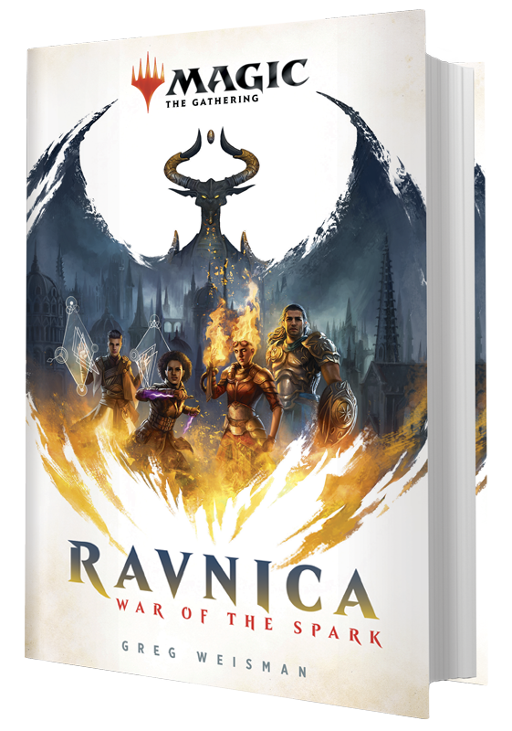

看了几本奇幻小说后，发现自己对这类故事还是很着迷的，所以想聊一下下我看过的和准备看的奇幻小说。

说来接触的第一本奇幻小说，竟然就是托尔金的《魔戒》，但当时的我心浮气躁，一看到大段的场景描写和故事铺垫，就打不起精神。正好当时在玩暴雪的游戏“魔神争霸”，就转头看起魔兽系列小说。

魔兽系列小说中我最喜欢的长篇是极具史诗感的《上古之战三部曲》，也是我最初开始读的。后面又读了很多其他的故事，但“上古之战”绝对称得上是经典。当然，也非常通俗朴实，文笔稍逊就是了，这大概是所有游戏改编小说的通病了。

往后读《部落的崛起》与魔兽争霸正传故事已经是大学的事情了，但都无法超越“上古之战”对我的影响，直到我看了短篇《最后的守护者》。“守护者”这个故事也是少有的非线性叙事，连同它少有的远超平均水平的文笔。《魔兽》电影上映前，我就对朋友说，如果要挑一个故事拍第一部魔兽电影，那这一段时间发生的故事当是最好的选择，结果也被我言中了。

魔兽固然看得很爽，但听说了这些都是以托尔金构想的中土世界为蓝本建立的，我便决定这《魔戒》还是要啃的。可能与其他人不太一样，我是按照故事的时间顺序读的，从《精灵宝钻》到《霍比特人》，再到正传，只是后面三本没有看完有点可惜。

哦，说到魔法，还有一个流行的，只是这个系列我只看了一本书，后续的电影倒是一步不落看了好几遍，那就是《哈利波特》。

还是说点相对比较小众的吧。刚开始工作时因为要坐（站）一个小时的公交车上下班，我就听写电台、播客消磨痛苦的通勤时间，从此接触了“机核”这个以游戏为中心包含一切的自媒体平台。我听了《猎魔人》那期节目，几位嘉宾在一起聊了一个波兰人写的混杂了魔兽的种族、吸血鬼、狼人、童话故事与波兰民俗的神奇世界，还有不那么一样的主角杰洛特。于是我玩了《巫师3》游戏，又买了4本《猎魔人》小说，充分地享受了这个不逊于《冰与火之歌》的丰富世界。

也是在机核电台，我了解了当代“剑与魔法”游戏的另一蓝本——《龙与地下城》。上来就在Kindle上买了《黑暗精灵三部曲》，乖乖的，这三本书要是纸质的不知道有多厚嘞，但可怕的是，没几个星期我就看完了整个三部曲——《家园》、《流亡》、《旅居》。我捉摸着这主角崔斯特真是好呀，作为一个精灵能活这么久，后面竟然还有一个三部曲。

在逛苏州诚品书店时我看到了它们——《冰风谷三部曲》，那可是三本像字典一样的书呀。于是崔斯特的故事继续，在这个“被遗忘的国度”，更宏大的故事由此展开。虽然是同一个作者所写，这两个三部曲的风格确很不一样，保持不变的是黑暗精灵崔斯特的烦恼和略显平庸的文笔，和魔兽一样的问题。这大概也更接近网络文学，通俗的文字便于大多数人阅读和理解，也不妨你一目十行的飞快扫过。

DNN的小说还有著名的《龙枪》系列，我还没但是迟早要看的。现在又听说了”万智牌“主线剧情的新小说也出了，来看看这个封面。

对，这就是《火花之战》，下一个名单，就是你了。不过现在可能要坐等翻译了。

由于众所周知的原因，我可能要补一下《冰与火之歌》的小说了。